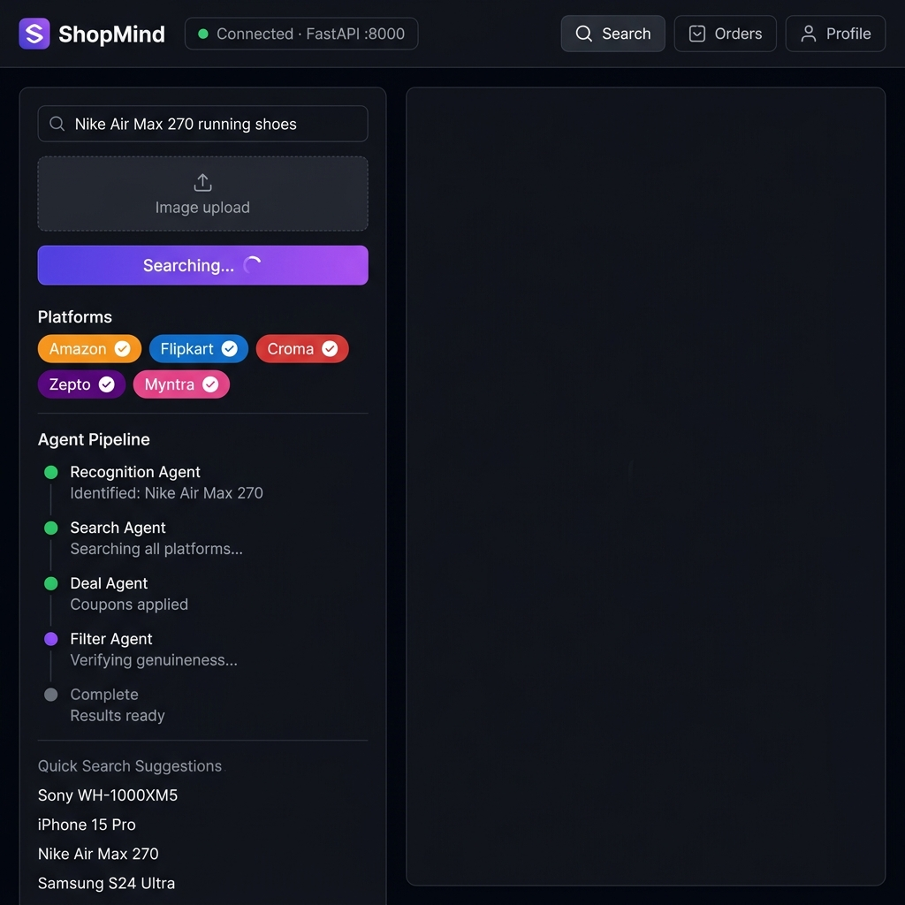
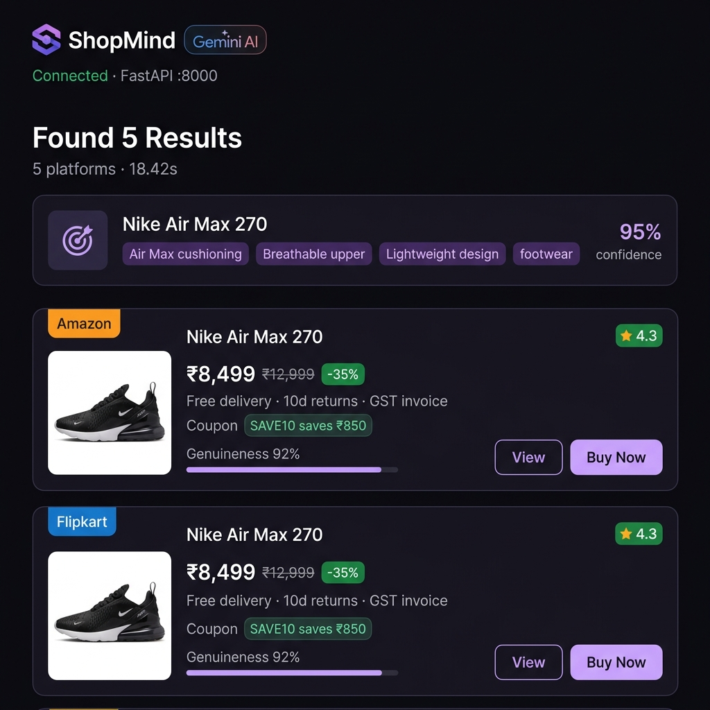
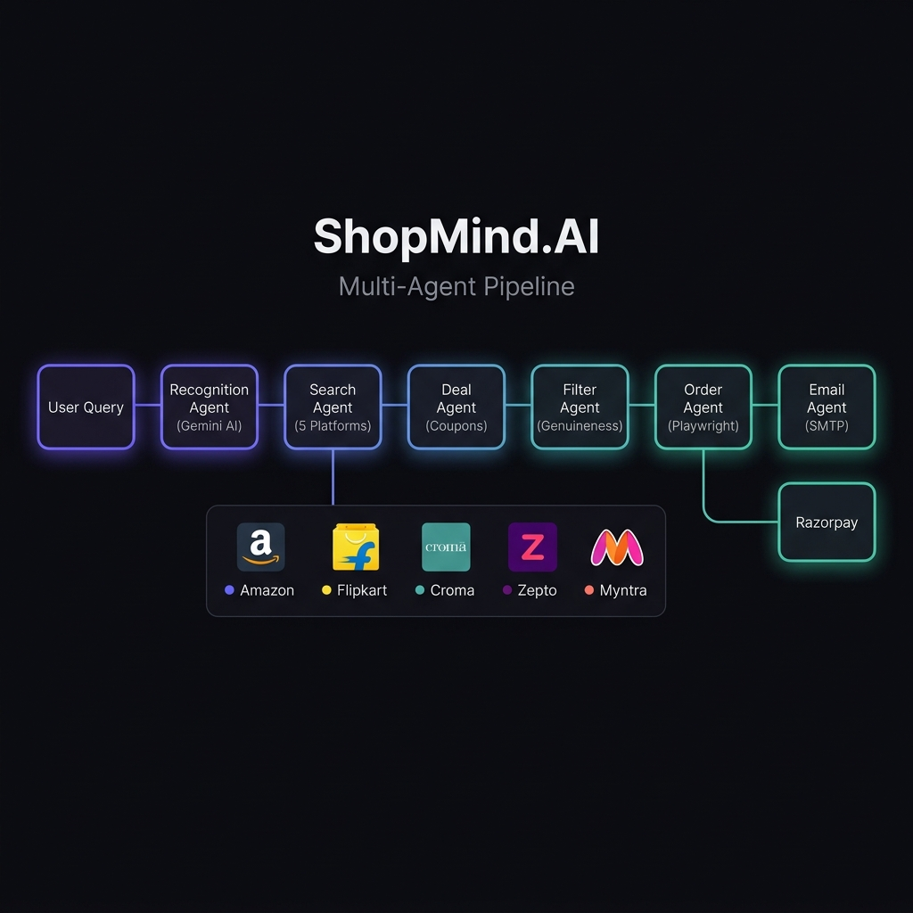
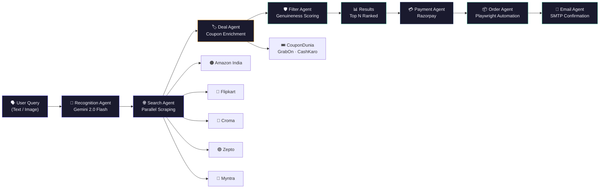
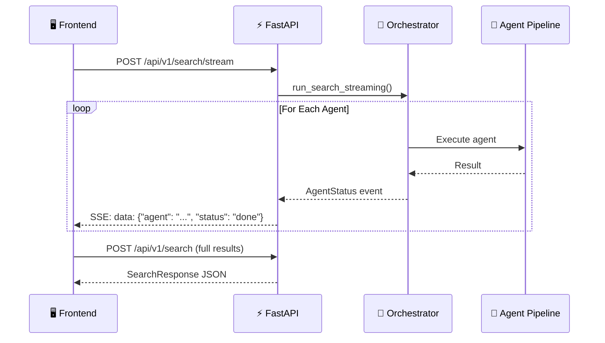

<


<br/>

[🚀 Quick Start](#-quick-start) · [📸 Screenshots](#-screenshots) · [🏗️ Architecture](#%EF%B8%8F-system-architecture) · [📡 API Reference](#-api-reference) · [🗺️ Roadmap](#%EF%B8%8F-feature-roadmap)

<br/>

</div>

---

## 📸 Screenshots

<div align="center">

<table>
<tr>
<td width="50%">



<p align="center"><em>🔍 Live Agent Pipeline — Real-time search with SSE streaming</em></p>

</td>
<td width="50%">



<p align="center"><em>🎯 Product Recognition — AI-identified specs with confidence score</em></p>

</td>
</tr>
</table>

</div>

> **🎬 Demo Recording:** _Drop a `.mp4` or `.gif` file into `assets/demo.mp4` and uncomment the line below._
>
> <!-- https://github.com/user-attachments/assets/YOUR_VIDEO_ID -->

---

## ✨ What is ShopMind.AI?

ShopMind.AI is a **production-grade multi-agent system** that automates the entire e-commerce shopping lifecycle:

| Step | What Happens | Agent |
|:----:|:-------------|:------|
| **1** | User describes a product via text or uploads an image | —  |
| **2** | AI identifies the exact product, brand, model & specs | 🔎 Recognition Agent |
| **3** | 5 e-commerce platforms are scraped **simultaneously** | 🌐 Search Agent |
| **4** | Live coupon codes are fetched and applied to results | 🏷️ Deal Agent |
| **5** | Each listing is scored for genuineness & authenticity | 🛡️ Filter Agent |
| **6** | Secure payment via Razorpay (UPI / Card / COD) | 💳 Payment Agent |
| **7** | Order is placed via headless browser automation | 📦 Order Agent |
| **8** | Confirmation email is sent with full order details | 📧 Email Agent |

---

## 🏗️ System Architecture

<div align="center">



</div>

<br/>

### Agent Pipeline — Mermaid Diagram



### Streaming Architecture (SSE)



---

## 🧬 Agent Deep Dive

<details>
<summary><b>🔎 Agent 1 — Recognition Agent</b> · <code>agents/recognition_agent.py</code></summary>

<br/>

**Purpose:** Identifies the exact product from natural language text or an uploaded image.

| Feature | Detail |
|---------|--------|
| **Model** | Google Gemini 2.0 Flash |
| **Input** | Text query, base64 image, or both |
| **Output** | Normalized name, brand, model, category, key specs, platform-optimized search terms |
| **Confidence** | Returns a 0–1 confidence score |
| **Retry Logic** | Exponential backoff (5 attempts) for 429 rate limits |
| **Image Detection** | Auto-detects JPEG/PNG from base64 header bytes |

```
Output Schema:
{
  "normalized_name": "Sony WH-1000XM5",
  "brand": "Sony",
  "model": "WH-1000XM5",
  "category": "electronics",
  "key_specs": ["ANC", "30hr battery", "Bluetooth 5.3"],
  "search_terms": ["Sony WH1000XM5 headphone", ...],
  "confidence": 0.95
}
```

</details>

<details>
<summary><b>🌐 Agent 2 — Search Agent</b> · <code>agents/search_agent.py</code></summary>

<br/>

**Purpose:** Searches all platforms **in parallel** using `asyncio.gather` and Playwright browser automation.

| Platform | Scraper | Delivery | Returns |
|----------|---------|----------|---------|
| 🟠 Amazon India | `scrape_amazon()` | 2-day | 10 days |
| 🔵 Flipkart | `scrape_flipkart()` | 3-day | 7 days |
| 🔴 Croma | `scrape_croma()` | 4-day | 7 days |
| 🟣 Zepto | `scrape_zepto()` | 10-min | 2 days |
| 🩷 Myntra | `scrape_myntra()` | 5-day | 30 days |

- **Anti-detection:** Custom user agents, viewport spoofing, locale/timezone injection
- **Resource blocking:** Media & fonts blocked for speed, images kept for product detection
- **Fallback selectors:** Each platform has 3–6 CSS selector strategies with graceful degradation

</details>

<details>
<summary><b>🏷️ Agent 3 — Deal Agent</b> · <code>agents/deal_agent.py</code></summary>

<br/>

**Purpose:** Finds and applies the best available coupon code for each product result.

**Two-tier coupon strategy:**
1. **Live scraping** — Hits CouponDunia, GrabOn, CashKaro in real-time
2. **Known coupons fallback** — Pre-loaded bank & platform coupon database

```
Example coupons applied:
  Amazon  → SAVE10 (10% off, min ₹1,000) | SBIEMI (₹500 flat, min ₹10,000)
  Flipkart → FKFIRST (10%, min ₹1,000) | AXISBANK (₹250 flat)
  Myntra   → STYLE20 (20% off, min ₹800)
```

Each result's `final_price` is recalculated after the best coupon is applied.

</details>

<details>
<summary><b>🛡️ Agent 4 — Filter Agent</b> · <code>agents/filter_agent.py</code></summary>

<br/>

**Purpose:** Scores each listing for authenticity using a **hybrid heuristic + AI** approach.

**Scoring Pipeline:**

```
Base Score (platform trust)
  └─ Amazon: 0.85 │ Flipkart: 0.82 │ Croma: 0.95 │ Myntra: 0.88 │ Zepto: 0.80
      ├─ Price anomaly check (< 40% of median → −0.30)
      ├─ Low reviews penalty (< 10 reviews → −0.10)
      ├─ High trust bonus (≥ 4.0★ & 100+ reviews → +0.05)
      ├─ Brand mismatch penalty (brand missing from title → −0.15)
      └─ Borderline? → Gemini AI analysis → (heuristic + AI) / 2
```

Results below **0.50** are filtered out. Remaining results are sorted by `(−genuineness_score, +final_price)`.

</details>

<details>
<summary><b>💳 Agent 5 — Payment Agent</b> · <code>agents/payment_agent.py</code></summary>

<br/>

**Purpose:** Integrates Razorpay for secure UPI/Card payments with server-side signature verification.

| Feature | Detail |
|---------|--------|
| **Gateway** | Razorpay India |
| **Methods** | UPI, Credit/Debit Card, COD |
| **Verification** | HMAC-SHA256 signature verification |
| **Mock mode** | Auto-enabled when Razorpay keys are absent |
| **Frontend** | Razorpay Checkout.js modal integration |

</details>

<details>
<summary><b>📦 Agent 6 — Order Agent</b> · <code>agents/order_agent.py</code></summary>

<br/>

**Purpose:** Places the order on the target platform using Playwright browser automation.

**Platform-specific handlers:**
- `_order_amazon()` — Add to cart → Checkout → Fill address → Select COD
- `_order_flipkart()` — Buy Now → Fill delivery → Proceed
- `_order_croma()` — Opens browser (OTP login required)
- `_order_myntra()` / `_order_zepto()` — Automated flow initiation

Each order generates a unique ID (e.g., `AMZ-A3F92BC1DA`, `FK-7E2C1A9B03`).

</details>

<details>
<summary><b>📧 Agent 7 — Email Agent</b> · <code>agents/email_agent.py</code></summary>

<br/>

**Purpose:** Sends a rich HTML confirmation email via Gmail SMTP.

**Email includes:**
- ✅ Order ID & platform
- 📦 Product title & amount
- 🎟️ Coupon applied (if any)
- 📍 Delivery address
- 📅 Expected delivery date
- 🔗 Tracking link (when available)

Uses TLS encryption via `smtplib` with Gmail App Password authentication.

</details>

---

## 🚀 Quick Start

### Prerequisites

- Python 3.11+
- Google Chrome or Chromium
- A [Google AI Studio](https://aistudio.google.com/) API key (Gemini)

### 1. Clone & Install

```bash
git clone https://github.com/SHYam1025/ShopMind.AI.git
cd ShopMind.AI

# Create virtual environment
python -m venv venv
source venv/bin/activate        # macOS/Linux
# venv\Scripts\activate          # Windows

# Install dependencies
pip install -r requirements.txt

# Install browser for scraping
playwright install chromium
```

### 2. Configure Environment

```bash
cp .env.example .env
```

Edit `.env` with your credentials:

```env
# ── Required ──────────────────────────────
GEMINI_API_KEY=your_gemini_api_key_here

# ── Email (Gmail SMTP) ───────────────────
EMAIL_FROM=yourgmail@gmail.com
EMAIL_PASSWORD=your_gmail_app_password
EMAIL_FROM_NAME=ShopMind AI

# ── Payment (Optional) ──────────────────
RAZORPAY_KEY_ID=rzp_test_xxxxxxxxxxxx
RAZORPAY_KEY_SECRET=your_razorpay_secret

# ── Optional ─────────────────────────────
SERPAPI_KEY=your_serpapi_key
APP_ENV=development
LOG_LEVEL=INFO
```

### 3. Run

```bash
# Development mode with auto-reload
uvicorn main:app --reload --port 8000

# Or simply
python main.py
```

Open **http://localhost:8000** in your browser → the ShopMind UI loads automatically.

---

## 📡 API Reference

All endpoints are prefixed with `/api/v1`.

### Search

| Method | Endpoint | Description |
|:------:|:---------|:------------|
| `POST` | `/search` | Run full 6-agent search pipeline, return ranked results |
| `POST` | `/search/stream` | Same pipeline with **SSE streaming** of agent status events |

<details>
<summary><b>Request / Response Schema</b></summary>

**Request Body:**
```json
{
  "query": "Sony WH-1000XM5 headphones",
  "image_base64": null,
  "platforms": ["amazon", "flipkart", "croma", "zepto", "myntra"],
  "max_results": 5
}
```

**Response:**
```json
{
  "recognized": {
    "normalized_name": "Sony WH-1000XM5",
    "brand": "Sony",
    "category": "electronics",
    "key_specs": ["ANC", "30hr battery"],
    "confidence": 0.95
  },
  "results": [
    {
      "platform": "amazon",
      "title": "Sony WH-1000XM5 Wireless Headphones",
      "price": 24990,
      "final_price": 22491,
      "coupon_code": "SAVE10",
      "genuineness_score": 0.92,
      "url": "https://amazon.in/dp/..."
    }
  ],
  "best_deal": { ... },
  "total_platforms_searched": 5,
  "search_duration_seconds": 18.42
}
```

</details>

### Payment & Orders

| Method | Endpoint | Description |
|:------:|:---------|:------------|
| `POST` | `/payment/create` | Create a Razorpay order for UPI/Card payment |
| `POST` | `/payment/verify` | Verify Razorpay signature & place the order |
| `POST` | `/order` | Place a COD order directly (bypasses payment gateway) |
| `GET`  | `/orders/{email}` | Retrieve order history for an email address |

### Profile & Health

| Method | Endpoint | Description |
|:------:|:---------|:------------|
| `GET`  | `/profile/{email}` | Get saved delivery profile |
| `POST` | `/profile` | Save/update delivery profile |
| `GET`  | `/health` | Service health check |

---

## 📁 Project Structure

```
ShopMind.AI/
├── main.py                        # FastAPI entry point + lifespan manager
├── config/
│   └── settings.py                # Pydantic Settings (env vars, platform configs, coupon sources)
├── models/
│   └── schemas.py                 # 12 Pydantic models (request/response/internal)
├── agents/
│   ├── orchestrator.py            # Master coordinator — runs all agents in sequence
│   ├── recognition_agent.py       # Agent 1: Gemini Vision product identification
│   ├── search_agent.py            # Agent 2: Parallel multi-platform scraping
│   ├── deal_agent.py              # Agent 3: Coupon fetching & price enrichment
│   ├── filter_agent.py            # Agent 4: Genuineness scoring (heuristic + AI)
│   ├── payment_agent.py           # Agent 5: Razorpay payment integration
│   ├── order_agent.py             # Agent 6: Playwright browser automation ordering
│   └── email_agent.py             # Agent 7: SMTP HTML email confirmation
├── api/
│   └── routes.py                  # 8 FastAPI route handlers + SSE streaming
├── utils/
│   ├── scraper.py                 # Playwright scrapers (Amazon, Flipkart, Croma, Zepto, Myntra)
│   └── storage.py                 # Async SQLite storage (profiles + order history)
├── shopmind_ui.html               # Full-featured SPA frontend (1000+ lines)
├── requirements.txt               # 17 Python dependencies
├── assets/                        # README images and media
└── .env                           # Environment variables (git-ignored)
```

---

## 📊 Tech Stack

| Layer | Technology | Purpose |
|:------|:-----------|:--------|
| **AI / LLM** | Google Gemini 2.0 Flash | Product recognition, coupon extraction, genuineness analysis |
| **Backend** | FastAPI + Uvicorn | Async REST API with SSE streaming |
| **Scraping** | Playwright (Chromium) | Headless browser automation for 5 platforms |
| **Payment** | Razorpay Checkout.js | UPI, Card, Netbanking payments with signature verification |
| **Email** | Gmail SMTP + TLS | Rich HTML order confirmation emails |
| **Database** | SQLite + aiosqlite | Async storage for profiles & order history |
| **Validation** | Pydantic v2 | Request/response schemas with strict typing |
| **HTTP** | httpx | Async HTTP client for coupon site scraping |
| **HTML Parsing** | BeautifulSoup4 + lxml | Fallback HTML parsing for coupon extraction |
| **Frontend** | Vanilla HTML/CSS/JS | Dark-theme SPA with SSE live updates |
| **Fonts** | Syne + DM Sans | Modern typography via Google Fonts |

---

## 🗺️ Feature Roadmap

### ✅ Implemented

- [x] Multi-agent orchestrator with sequential pipeline execution
- [x] Gemini 2.0 Flash vision-based product recognition (text + image)
- [x] Parallel scraping of 5 Indian e-commerce platforms
- [x] Anti-detection measures (UA spoofing, viewport, locale, resource blocking)
- [x] Multiple CSS selector fallbacks per platform (3–6 strategies each)
- [x] Live coupon scraping from CouponDunia + GrabOn + CashKaro
- [x] Known coupon database with bank offers (HDFC, SBI, Axis)
- [x] Hybrid genuineness scoring (heuristic rules + Gemini AI analysis)
- [x] Platform trust scoring (Amazon 0.85, Croma 0.95, etc.)
- [x] Price anomaly detection (suspicious if < 40% median)
- [x] Razorpay payment gateway integration (UPI / Card / COD)
- [x] Server-side HMAC-SHA256 signature verification
- [x] Playwright browser automation for order placement
- [x] Platform-specific checkout handlers (Amazon, Flipkart)
- [x] Address auto-fill during checkout
- [x] Gmail SMTP HTML email confirmations with TLS
- [x] SSE (Server-Sent Events) real-time agent status streaming
- [x] Dark-theme SPA frontend with live pipeline visualization
- [x] Order history with persistent SQLite storage
- [x] Delivery profile management (save & auto-fill)
- [x] Exponential backoff retry for Gemini API rate limits
- [x] Image upload with base64 encoding & media type detection
- [x] FastAPI auto-generated Swagger docs at `/docs`

### 🔜 Roadmap

- [ ] User authentication (Supabase / JWT)
- [ ] Price drop alerts & watchlist
- [ ] Browser session persistence (login cookies)
- [ ] CAPTCHA bypass integration (2Captcha / hCaptcha solver)
- [ ] Product price history charts
- [ ] Multi-language support (Hindi, Tamil, Telugu)
- [ ] Mobile-responsive PWA frontend
- [ ] Redis caching for search results
- [ ] Webhook notifications (Slack, Discord, Telegram)
- [ ] Admin dashboard with analytics
- [ ] Docker containerization & CI/CD pipeline
- [ ] Rate limiting & API key authentication
- [ ] Product recommendation engine
- [ ] Voice search via Web Speech API

---

## ⚙️ Configuration Reference

All configuration is managed via environment variables loaded through **Pydantic Settings**:

| Variable | Required | Default | Description |
|:---------|:--------:|:--------|:------------|
| `GEMINI_API_KEY` | ✅ | — | Google AI Studio API key |
| `EMAIL_FROM` | ✅ | — | Gmail address for sending emails |
| `EMAIL_PASSWORD` | ✅ | — | Gmail App Password (not regular password) |
| `RAZORPAY_KEY_ID` | ❌ | — | Razorpay key (mock mode if absent) |
| `RAZORPAY_KEY_SECRET` | ❌ | — | Razorpay secret |
| `SERPAPI_KEY` | ❌ | — | SerpAPI key for enhanced search |
| `APP_ENV` | ❌ | `development` | `development` / `production` |
| `LOG_LEVEL` | ❌ | `INFO` | `DEBUG` / `INFO` / `WARNING` / `ERROR` |
| `HEADLESS` | ❌ | `true` | Run Chromium in headless mode |
| `REQUEST_TIMEOUT_SECONDS` | ❌ | `20` | Scraper timeout per platform |
| `MAX_SEARCH_RESULTS_PER_PLATFORM` | ❌ | `5` | Max results returned per platform |

---

## 🤝 Contributing

Contributions are welcome! Here's how to get started:

1. **Fork** the repository
2. **Create** a feature branch: `git checkout -b feature/amazing-feature`
3. **Commit** your changes: `git commit -m "feat: add amazing feature"`
4. **Push** to the branch: `git push origin feature/amazing-feature`
5. **Open** a Pull Request

### Code Style

- Python: Follow PEP 8 with type hints
- Commits: Use [Conventional Commits](https://www.conventionalcommits.org/) format
- PRs: Include a clear description of changes and screenshots if UI-related

---

## 📄 License

This project is licensed under the **MIT License** — see the [LICENSE](LICENSE) file for details.

---

## 📬 Contact

**Shyam Pathak** — Project Author

[](https://github.com/SHYam1025)

---

<div align="center">

<br/>

**Built with ❤️ and a lot of ☕**

_ShopMind.AI — Because smart shopping shouldn't be manual._

<br/>


</div>
]]>
